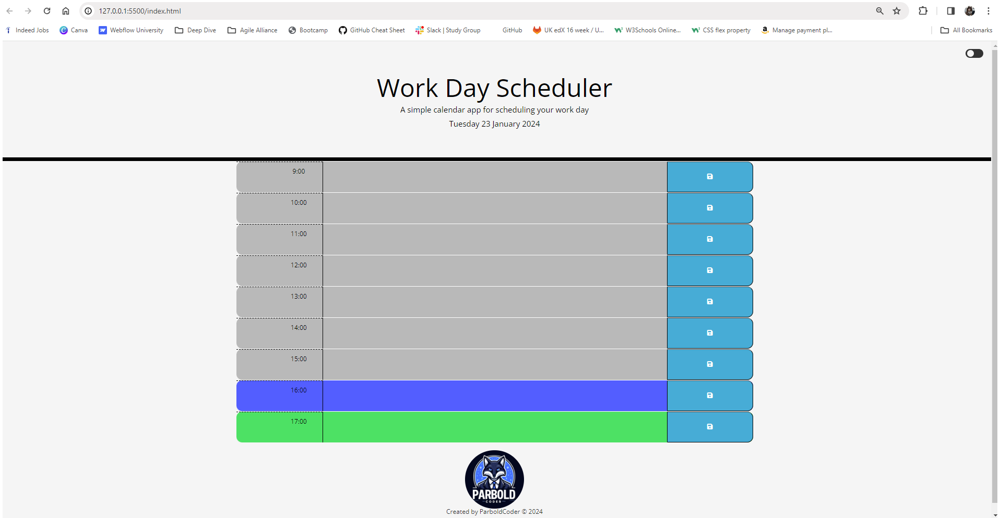

# WorkDayScheduler

## Description
 
I've developed a script to construct a daily planner web page enabling the scheduling of activities for each hour of a standard workday. The initial step involves utilizing jQuery to select elements from the HTML, identifying the elements with IDs "currentDay" and "container" for the current day's display and the container for time blocks, respectively.
 
Following that, an array of hours from 9 AM to 5 PM is generated using the Array.from method. The current date and time are also captured using the dayjs library.
 
The script comprises several functions:
 
 
The setDay function updates the display of the current day in the designated element.
 
 
The createTimeBlocks function dynamically creates time blocks for each hour using a loop. Each block includes a form with an hour display, a textarea for user input, and a save button.
 
 
The assignColor function assigns a color class to each time block based on a comparison between the block's hour and the current hour. It uses classes like "past," "present," and "future" to visually represent whether an hour has passed, is current, or is in the future.
 
 
The script features an event listener that captures form submissions. When text is entered into a textarea and the save button is clicked, the entered text is stored in the local storage with a key corresponding to the hour of the time block.
 
 
The assignStoredText function retrieves stored text from local storage for each time block and fills the respective textarea with the stored data.
 
 
Finally, the script executes the functions in a specific order: setDay to update the current day display, createTimeBlocks to generate the time blocks, assignColor to apply color coding based on the current time, and assignStoredText to populate textareas with previously stored data.
 
 
Essentially, this script facilitates the creation of a personalized daily plan, allowing the saving and retrieval of data for each hour while providing visual cues for past, present, and future activities.
 
 
This one I did find challenging and eventually got it in the end, I also decided add a dark mode to showcase my ability.
 
 
Unfortunately, I am not able to get this to work correctly, even though I referenced a previous challenge. ¯\_(ツ)_/¯
 
 
## Application images

 

 

 

## Application URLs
https://github.com/ParboldCoder/WorkDayScheduler
 
https://parboldcoder.github.io/WorkDayScheduler/
 
## Author
Darren Buck
https://github.com/ParboldCoder